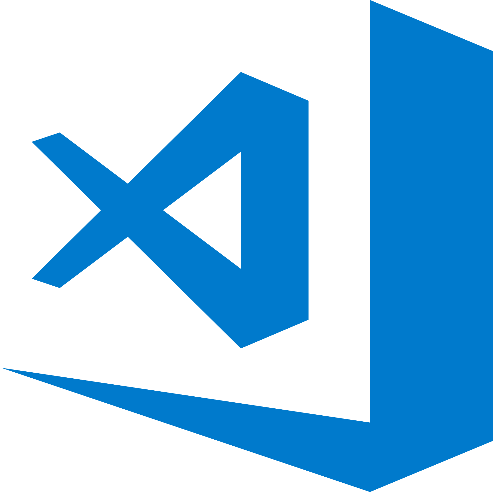

## 👋 Hi, I’m Gonçalo Barradas 

### I'm a student of Computer Science at University of Évora   , Portugal

  - 👀 I’m interested in      Python  ...
- 🌱 I’m currently learning Java  ...

## Contact me:

   
 
## Languages:

 
  
 
## Tools 🧰:  
 
 

  
## Status:

 

